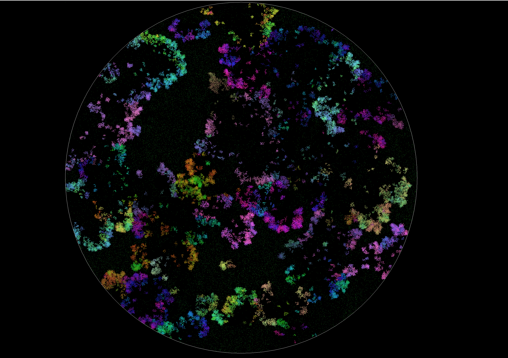
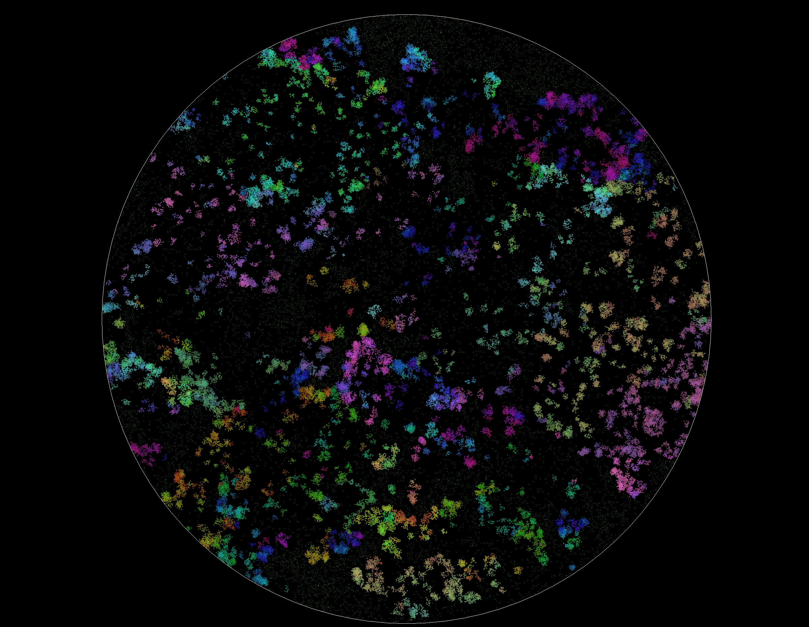
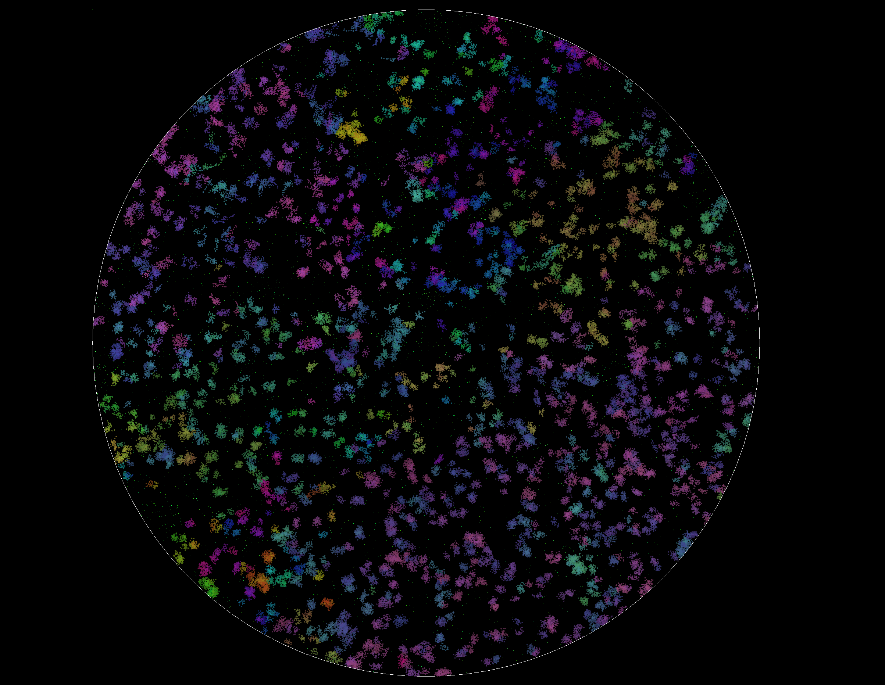
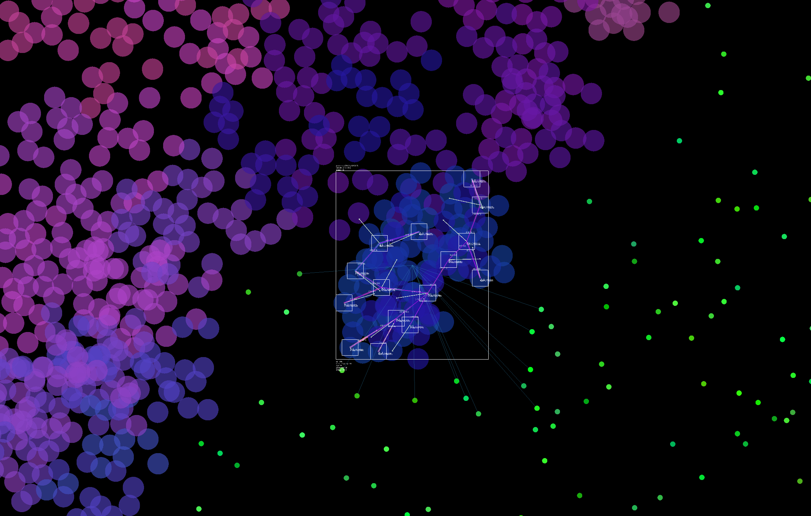
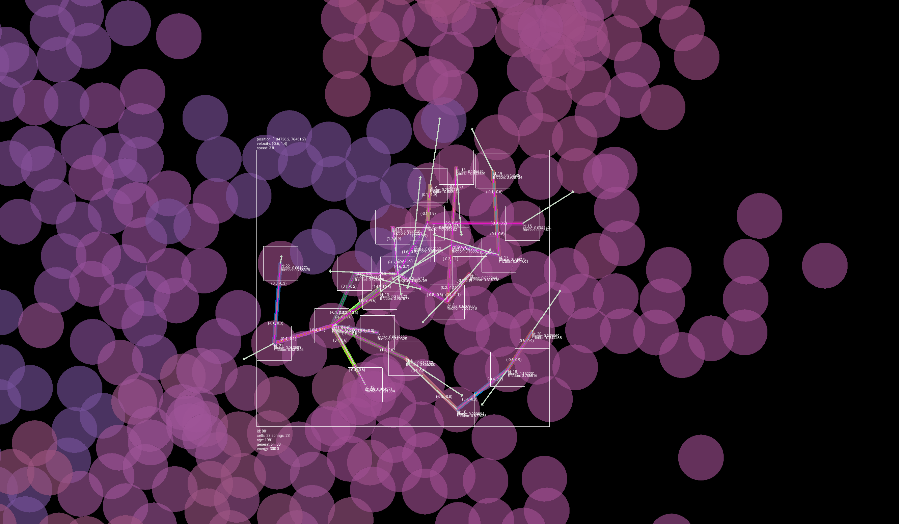

# Project A.R.I.A
### Adaptive Realtime Intelligence Architecture

A realtime 2D evolution and natural selection simulator built in C++23 and SFML 3. Organisms called *protozoa* are composed of physical cells connected by springs, driven by a sin-wave genetic system that mutates across generations. Watch natural selection unfold as organisms grow, compete for food, reproduce, and die — becoming progressively fit to their environment over thousands of generations.

---







---

## How It Works

Each protozoa is a small physics object made of **cells** (circles) connected by **springs**. Every cell and spring has its own gene — a sin-wave with four parameters (`amplitude`, `frequency`, `offset`, `vertical_shift`) — that controls how it moves and behaves. Cells modulate their own friction, springs modulate their rest length, and the combination produces emergent locomotion.

When a protozoa eats enough food it reproduces, passing its genome to an offspring with small random mutations applied. Over generations, organisms that move efficiently and find food survive longer and reproduce more — natural selection in action.

### Organism Close-ups





---

## Features

- **Real-time physics** — cells and springs simulate Hooke's law with damping every frame
- **Sin-wave genetic system** — every cell and spring has its own evolvable gene controlling behaviour
- **Structural mutation** — organisms can grow new cells and lose springs across generations, changing their physical shape
- **Spatial hash grid** — accelerates proximity queries for both cell collision and food detection across up to 80,000 food particles
- **Batch circle renderer** — all cells rendered in a single `sf::VertexArray` draw call regardless of population size
- **Custom object pool** (`o_vector`) — fixed-size pool with O(1) add/remove, used for protozoa and food
- **Debug overlay** — select any organism to inspect its cells, springs, forces, gene values, energy, and lineage in real time
- **Protozoa builder** — design and spawn custom organisms with a visual editor
- **Crash reporter** — structured crash logs with stack traces written to `crash.log` on any unhandled exception

---

## Getting Started

### Prerequisites

- Windows (primary) or Linux
- C++23 compiler — **MSVC via Visual Studio 2022 v17.5+** recommended on Windows
- CMake 3.21 or later
- Git (CMake fetches SFML 3 automatically — no manual installation needed)

### Build
```bash
git clone https://github.com/curtis-aln/Evolution-Simulator.git
cd Evolution-Simulator
cmake -B build -DCMAKE_BUILD_TYPE=Release
cmake --build build --config Release
```

The `media/` folder is automatically copied next to the executable as a post-build step.

### Run
```bash
./build/Release/ProjectARIA      # Linux
build\Release\ProjectARIA.exe    # Windows
```

Or open the folder in Visual Studio 2022, let it detect the `CMakeLists.txt`, and press **Run**.

---

## Controls

| Input | Action |
|---|---|
| `Scroll wheel` | Zoom in / out |
| `Left hold` | Pan camera |
| `Left click` | Select protozoa |
| `Space` | Pause / unpause |
| `R` | Toggle rendering |
| `S` | Toggle simple mode (outer cells only) |
| `G` | Toggle cell collision grid overlay |
| `F` | Toggle food grid overlay |
| `D` | Toggle debug mode |
| `K` | Toggle skeleton mode *(debug mode only)* |
| `B` | Toggle bounding boxes *(debug mode only)* |
| `C` | Toggle connections *(debug mode)* / toggle collisions *(normal mode)* |
| `O` | Step one frame *(while paused)* |
| `Escape` | Quit |

---

## Architecture
```
src/
├── main.cpp                        # Entry point and crash handler
├── settings.h                      # All simulation constants in one place
├── food_manager.h                  # Food spawning, spatial hashing, rendering
├── simulation/
│   ├── simulation.h/.cpp           # Window, camera, event loop, UI graphs
│   └── events.cpp                  # Input dispatching
├── world/
│   ├── world.h/.cpp                # Spatial grid, collision, rendering pipeline
│   ├── world_updating.cpp          # Per-frame update logic
│   └── ProtozoaManager.h           # Reproduction, death, population management
├── Protozoa/
│   ├── Protozoa.h                  # Organism class
│   ├── cell.h                      # Cell physics and gene evaluation
│   ├── spring.h                    # Spring physics and gene evaluation
│   ├── genome.h                    # Genetic system and mutation logic
│   └── extension/
│       ├── physics.cpp             # Cell and spring update, bounding box
│       ├── organic.cpp             # Food handling, reproduction, mutation
│       └── debug_graphics.cpp      # Debug rendering for selected organism
└── Utils/
    ├── o_vector.hpp                # Fixed-size object pool
    ├── thread_pool.h               # Worker thread pool
    ├── random.h                    # RNG utilities
    ├── Graphics/
    │   ├── CircleBatchRenderer.h   # Single-draw-call circle batching
    │   ├── spatial_hash_grid.h     # Food proximity queries
    │   └── simple_spatial_grid.h  # Cell collision queries
    └── UI/
        ├── CrashLogger.h           # Crash reporting with stack traces
        ├── Camera.hpp              # Pan and zoom camera
        ├── line_graph.h            # Real-time population graphs
        └── button.h / slider.h    # UI widgets
```

---

## Performance Notes

- Rendering is batched — all cells draw in one call via `CircleBatchRenderer`
- Collision detection uses a `SimpleSpatialGrid` (50×50) so only nearby cells are checked
- Food queries use a `SpatialHashGrid` (80×80) supporting up to 80,000 particles
- The `nearby_ids` buffer is stack-allocated and sized for 9-cell neighbourhood lookups
- A `ThreadPool` is available for parallelising update loops — not yet wired into the hot path

---

## Known Limitations (Beta)

- The protozoa builder's add-cell and add-spring features are not yet fully implemented
- Statistics graphs may render incorrectly at non-standard resolutions
- No save/load for simulation state
- Linux build is untested on the current SFML 3 CMake configuration

---

## License

MIT — see [LICENSE](LICENSE)

---

## Contributing

Fork the repo and open a feature branch. Keep PRs small and focused.