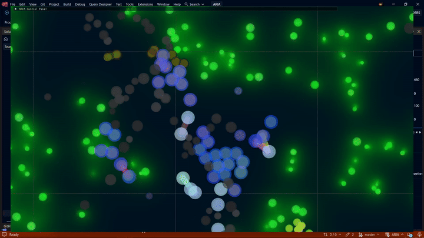
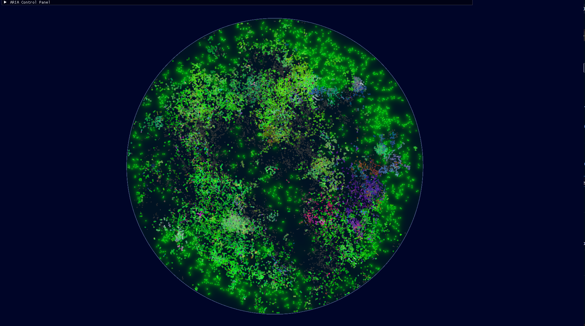
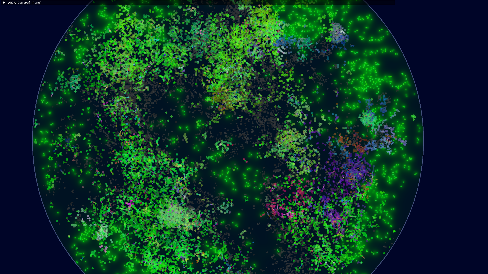
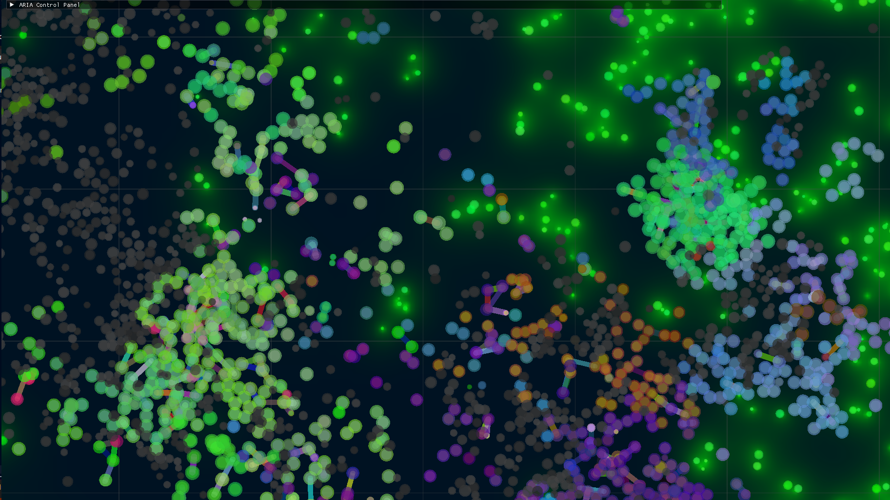
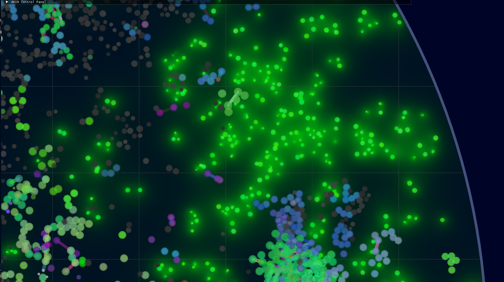
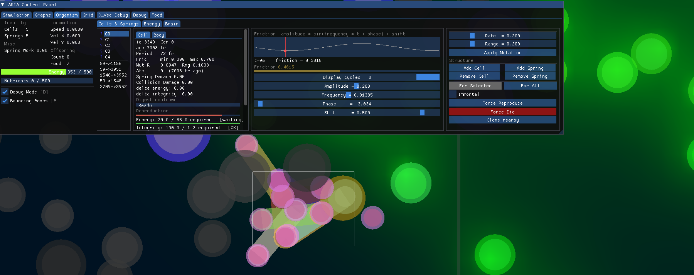
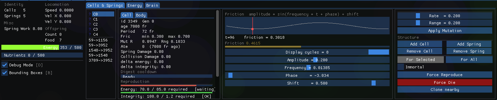
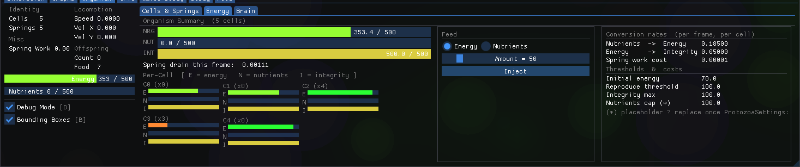

# Project A.R.I.A


### Adaptive Realtime Intelligence Architecture

[](https://youtu.be/rUsfT7OLaL8)

[](https://youtu.be/rUsfT7OLaL8)

| A realtime 2D evolution and natural selection simulator built in C++23 and SFML 3. Organisms called *protozoa* are made up of cells connected by springs. Locomotion is achieved by a sin-wave genetic system that mutates across generations. All behaviour between cells is localised, there is no "protozoa" class or container, only individual cells and springs exist.

---


Reproduction has to be Learned by the protozoa, and is not hard-coded.







---

## How It Works

Each protozoa is a small physics object made of **cells** (circles) connected by **springs**. Every cell and spring has its own gene — a sin-wave with four parameters (`amplitude`, `frequency`, `offset`, `vertical_shift`) — that controls how it moves and behaves. Cells modulate their own friction, springs modulate their rest length, and the combination produces emergent locomotion.

When it comes time to reproduce, each cell will create an offspring tied to itself through a weak spring, these offspring will "hunt" for other nearby offspring and connect to them.
This is a very messy process and leads to a lot of birth defects, but the organisms who survive the reproductive process go on to refine it and pass it down to their children. Over time, the population of protozoa will evolve to become more efficient at reproducing and surviving.

CellMatter consists of dead cells, they have a very high friction coefficient, and they last for tens of thousands of iterations, this creates a natural environment for the cells as moving through the cell matter
becomes more difficult, this lets speciation occur.


The Food in this simulation has no genes, they are simple and carry nutrients for the cells.


### ImGui Interface





There is a complex ImGui interface for the simulation, the above just shows the section for inspecting, debugging, and manipulating individual organisms

---

## Features

- **Real-time physics** — cells and springs simulate Hooke's law with damping every frame
- **Verlet integration** — cells update their position and velocity using a simple and stable numerical method
- **Genetic system** — every cell and spring has its own evolvable gene controlling behaviour
- **Dynamic Structures** — At any point in the simulation organisms can change their structure, adding or removing cells and springs
- **Spatial hash grid** — accelerates proximity queries for both cell collision and food detection across up to 80,000 food particles
- **GPU circle renderering** — all cells rendered in one draw call via a custom shader and vertex buffer
- **Advanced Debugging** — select any organism to inspect its cells, springs, forces, gene values, energy, and lineage in real time
- **Realistic Reproduction** — offspring are created by cells and must find and connect to other offspring to form a new organism

---

## Getting Started

### Prerequisites

- Windows (primary) or Linux
- C++23 compiler — **MSVC via Visual Studio 2022 v17.5+** recommended on Windows
- CMake 3.21 or later
- Git (CMake fetches SFML 3 automatically — no manual installation needed)

### Build
```bash
git clone https://github.com/curtis-aln/Evolution-Simulator.git
cd Evolution-Simulator
cmake -B build -DCMAKE_BUILD_TYPE=Release
cmake --build build --config Release
```

The `media/` folder is automatically copied next to the executable as a post-build step.

### Run
```bash
./build/Release/ProjectARIA      # Linux
build\Release\ProjectARIA.exe    # Windows
```

Or open the folder in Visual Studio 2022, let it detect the `CMakeLists.txt`, and press **Run**.

---

## Controls

| Input | Action |
|---|---|
| `Scroll wheel` | Zoom in / out |
| `Left hold` | Pan camera |
| `Left click` | Select protozoa |
| `Space` | Pause / unpause |
| `R` | Toggle rendering |
| `S` | Toggle simple mode (outer cells only) |
| `G` | Toggle cell collision grid overlay |
| `F` | Toggle food grid overlay |
| `D` | Toggle debug mode |
| `K` | Toggle skeleton mode *(debug mode only)* |
| `B` | Toggle bounding boxes *(debug mode only)* |
| `C` | Toggle connections *(debug mode)* / toggle collisions *(normal mode)* |
| `O` | Step one frame *(while paused)* |
| `Escape` | Quit |

---

## Settings
aria_settings.toml contains the default simulation settings. You can edit this file to change the initial conditions of the simulation.

## Performance Notes

- Rendering is batched — all cells draw in one call via `CircleBatchRenderer`
- Collision detection uses a `SimpleSpatialGrid` (50×50) so only nearby cells are checked
- Food queries use a `SpatialHashGrid` (80×80) supporting up to 80,000 particles
- The `nearby_ids` buffer is stack-allocated and sized for 9-cell neighbourhood lookups
- A `ThreadPool` is available for parallelising update loops — not yet wired into the hot path

---

## License

MIT — see [LICENSE](LICENSE)

---

## Contributing

Fork the repo and open a feature branch. Keep PRs small and focused.